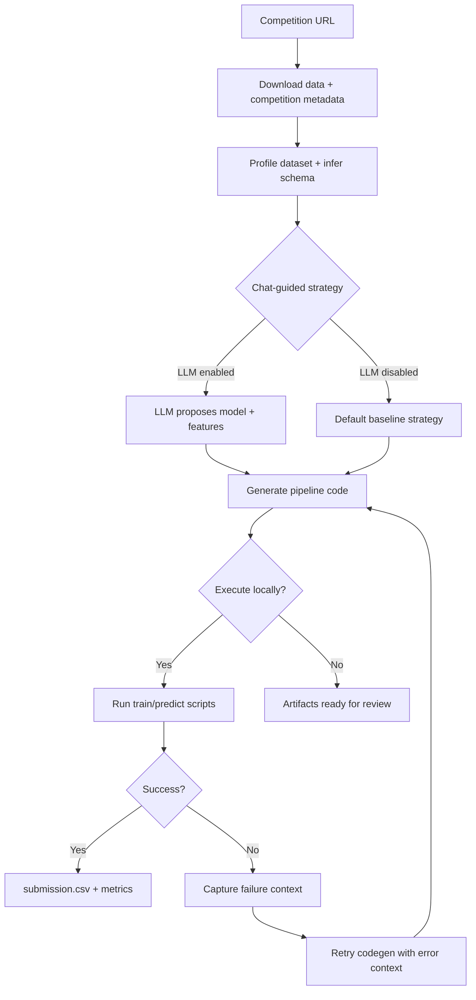

# AutoKaggle

AutoKaggle is a CLI-first tool that automates Kaggle competition workflows with minimal user input. You provide a competition URL, and AutoKaggle will download data, profile the dataset, ask an LLM for strategy guidance, generate a runnable baseline pipeline, and (optionally) execute it locally to produce a `submission.csv`.

## Why this design?

- **Why a CLI?** Kaggle workflows are naturally scriptable (download → train → submit). A CLI keeps runs reproducible, works well in CI or remote machines, and makes it easy to capture artifacts and logs without a UI dependency.
- **Why let an LLM evaluate data and propose steps?** Kaggle competitions vary widely. The LLM reads the competition rules, evaluation metric, and data profile so it can suggest model family, features, constraints, and hyperparameters that are more tailored than a one-size-fits-all template.
- **Why self-healing with retry steps?** Generated code can fail on edge cases (unexpected schemas, missing columns). AutoKaggle retries code generation with the failure context so the LLM can fix the specific error, improving reliability without manual intervention.

## Quickstart (clone → run → inspect)

1. **Clone the repo**
   ```bash
   git clone https://github.com/your-org/AutoKaggle.git
   cd AutoKaggle
   ```

2. **Create a virtual environment**
   ```bash
   python -m venv .venv
   source .venv/bin/activate
   ```

3. **Install dependencies**
   ```bash
   pip install -r requirements.txt
   ```

4. **Set credentials**
   AutoKaggle reads secrets from environment variables or a local `.env` file.

   ```bash
   export KAGGLE_API_TOKEN=your_kaggle_token
   export GOOGLE_API_KEY=your_google_api_key
   export AUTOKAGGLE_MODEL=gemini-3-flash-preview
   ```

5. **Run AutoKaggle**
   ```bash
   python -m autokaggle run https://www.kaggle.com/competitions/{competition}
   ```

6. **Inspect the run**
   ```bash
   python -m autokaggle status {run_id}
   python -m autokaggle logs {run_id}
   ls runs/{run_id}/output
   ```

## Workflow diagram



## What happens during a run?

1. **Competition discovery**: metadata, evaluation metric, and rules are fetched via the Kaggle API.
2. **Data profiling**: AutoKaggle scans CSVs in the downloaded dataset and produces a `data_profile.json`.
3. **Chat-guided strategy**: an LLM (default: Gemini) reviews the competition and data profile to propose a baseline strategy and hyperparameters (or you can skip this step).
4. **Pipeline generation**: AutoKaggle generates `data_loading.py`, `preprocess.py`, `train.py`, and `predict.py` plus an `env/requirements.txt` (LLM-generated if a key is available, otherwise templated locally).
5. **Local execution (optional)**: the generated scripts are executed in a per-run virtualenv to produce `metrics.json`, `model.joblib`, and `submission.csv`.
6. **Self-healing retries**: if execution fails, AutoKaggle regenerates code with the error context for a configurable number of retries.

## Repository structure (run artifacts)

```
runs/
  {run_id}/
    input/
      competition.json
      data_profile.json
      chat_transcript.md
      chat_decisions.json
    code/
      data_loading.py
      preprocess.py
      train.py
      predict.py
      strategy.py
    env/
      requirements.txt
      venv/
    output/
      model.joblib
      metrics.json
      submission.csv
    logs/
      run.log
```

## Configuration

AutoKaggle reads secrets from environment variables (or a `.env` file) and non-secret runtime
settings from an optional `config.yaml`. Environment variables always take precedence.

### Secrets (`.env`)

- `KAGGLE_API_TOKEN`: Kaggle API token (required to download competition data).
- `GOOGLE_API_KEY`: Google GenAI API key (required for chat + LLM codegen).

### Runtime settings (`config.yaml`)

```yaml
autokaggle_model: gemini-3-flash-preview
skip_download: false
skip_chat: false
skip_execution: false
max_codegen_retries: 3
```

You can still configure these via environment variables instead:

- `AUTOKAGGLE_MODEL`: LLM model name (default is configured in code).
- `AUTOKAGGLE_SKIP_DOWNLOAD=1`: skip downloading competition data (use existing `runs/{run_id}/input` contents).
- `AUTOKAGGLE_SKIP_CHAT=1`: skip the LLM strategy step and use a default baseline.
- `AUTOKAGGLE_SKIP_EXECUTION=1`: generate code without executing it.
- `AUTOKAGGLE_MAX_CODEGEN_RETRIES=3`: retries for self-healing code generation.

## Testing

```bash
pytest -q
```
